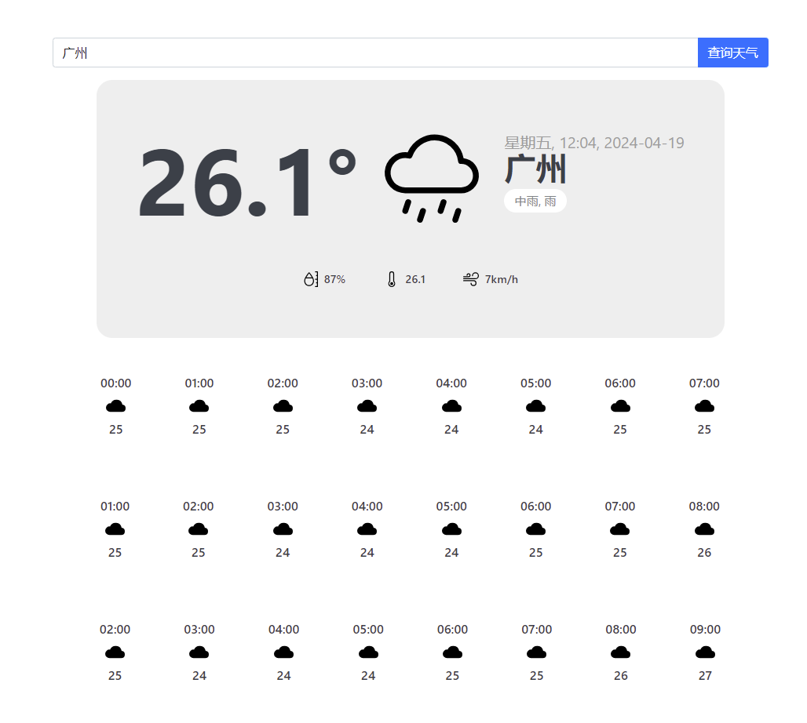

# Readme

### 1 目的 

> 做一个国内各大城市的天气查询工具，分别提供数据接口和界面显示
>
> 数据源来自 http://v1.yiketianqi.com

### 2 完成列表  

- [x]  城市天气查询接口 
- [x] 界面 
- [ ] swagger 接口文档

### 3 使用的技术 

- [x] python 3.11

- [x] flask 
- [x] bootstrap
- [x] jinja2

### 4 开发相关  

#### 4.1 获取代码 

```
git clone https://github.com/474416133/weather.git 
# 创建虚拟环境
cd weather 
pip install -r requirements/dev.txt
```


#### 4.2 代码目录说明 

```
├─app
│  ├─.env                    # 项目配置
│  ├─blueprints              
│  │  ├─api                  # 接口
│  │  ├─page                 # 页面
│  ├─common                  # 公共类库
│  ├─managers                # 数据操作管理类
│  ├─models                  # 数据模型
├─docker
├─logs                       # 日志
├─requirements               # 项目依赖库
├─static                     # 项目静态资源
├─templates                  # 页面模板
├─tests                      # 项目测试
```


#### 4.3 运行项目  

```
# 在虚拟环境中
cd weather 
python main.py
```


#### 4.4 页面效果图 



### 5 部署相关 

> 未实际部署，仅供参考

#### 5.1 生成docker镜像  

```
# 采用官方 python:3.11 镜像
# 也可以基于python:3.11镜像 构建自己的镜像

cd weather/docker-image
docker build -t python3.11-tz8:20240419 . 
```


#### 5.2 uwsgi.ini配置 

```
1 创建虚拟环境， 假设绝对目录为 /usr/src/app/venv
2 配置uwsgi.ini中的home和home和PYTHONHOME变量
home = /usr/src/app/venv

```


#### 5.3 docker run 命令 

> 参考 https://docs.docker.com/reference/cli/docker/container/run/   

```
cd weather 
chmod +x docker-run.sh
./docker-run.sh

```


#### 5.4 ssl与nginx的配置 

> 参考 https://nginx.org/en/docs/http/configuring_https_servers.html 


